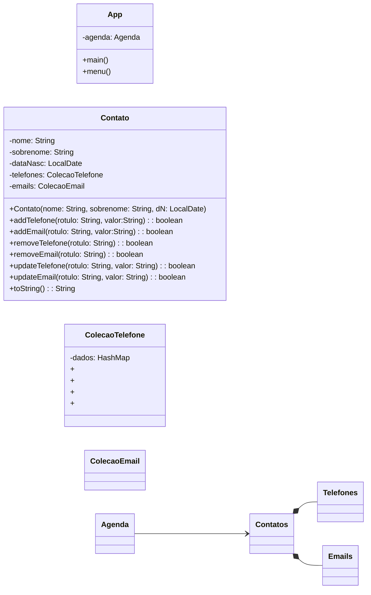

# SGAT

```mermaid
classDiagram
    direction LR

    class App {
        -agenda: Agenda
        +main()
        +menu()
    }   
    
    class Contato {
        -nome: String
        -sobrenome: String
        -dataNasc: LocalDate
        -telefones: ColecaoTelefone
        -emails: ColecaoEmail
        +Contato(nome: String, sobrenome: String, dN: LocalDate)
        +addTelefone(rotulo: String, valor:String): boolean
        +addEmail(rotulo: String, valor:String): boolean
        +removeTelefone(rotulo: String): boolean
        +removeEmail(rotulo: String): boolean
        +updateTelefone(rotulo: String, valor: String): boolean
        +updateEmail(rotulo: String, valor: String): boolean
        +toString(): String
     }

    class ColecaoTelefone  {
        -dados: HashMap<String><String>
        +
        +
        +
        +

    }

    class ColecaoEmail  {

    } 
        
 Contatos *-- Telefones
 Contatos *-- Emails
 Agenda --> Contatos     
    
```
