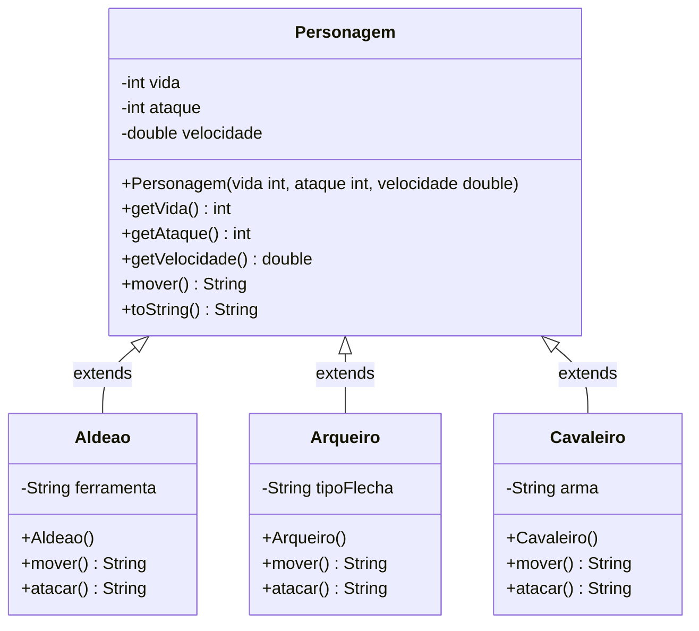

```mermaid
classDiagram
  direction TB

  class Personagem {
    -int vida
    -int ataque
    -double velocidade
    +Personagem(vida int, ataque int, velocidade double)
    +getVida() int
    +getAtaque() int
    +getVelocidade() double
    +mover() String
    +toString() String
  }

  class Aldeao {
    -String ferramenta
    +Aldeao()
    +mover() String
    +atacar() String
  }

  class Arqueiro {
    -String tipoFlecha
    +Arqueiro()
    +mover() String
    +atacar() String
  }

  class Cavaleiro {
    -String arma
    +Cavaleiro()
    +mover() String
    +atacar() String
  }

  Personagem <|-- Aldeao : extends
  Personagem <|-- Arqueiro : extends
  Personagem <|-- Cavaleiro : extends
```